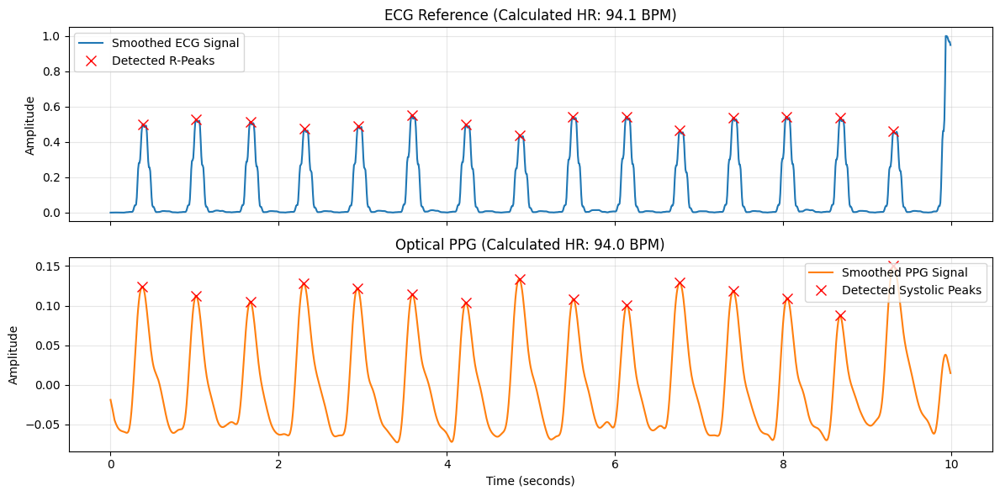

```python
import wfdb
import numpy as np
import scipy.signal as signal
import matplotlib.pyplot as plt

def preprocess_ecg_qrs(raw_ecg, fs):
    """
    Dedicated ECG preprocessing pipeline to isolate the QRS complex
    and maximize the relative amplitude of R-peaks vs T-waves.
    """
    # 1. Bandpass Filter (5 - 15 Hz) 
    # Targets QRS energy, heavily attenuates lower-frequency P and T waves
    nyquist = 0.5 * fs
    b, a = signal.butter(3, [5.0 / nyquist, 15.0 / nyquist], btype='band')
    bandpassed = signal.filtfilt(b, a, raw_ecg)
    
    # 2. Derivative
    # Enhances the steep slopes of the QRS complex
    derivative = np.gradient(bandpassed)
    
    # 3. Squaring Function
    # Non-linearly amplifies higher values (R-peaks) and crushes smaller values (T-waves)
    squared = derivative ** 2
    
    # 4. Moving Window Integration (Smoothing)
    # Merges the squared Q, R, and S waves into a single, clean 'hump' for easy detection
    window_size = int(0.12 * fs) # ~120ms window is standard for QRS width
    integrated = np.convolve(squared, np.ones(window_size)/window_size, mode='same')
    
    # Normalize to 0-1 scale for easier peak thresholding later
    normalized = integrated / np.max(integrated)
    
    return normalized

def process_ppg_get_hr(raw_signal, fs, is_ppg=False):
    """
    Processes a raw physiological signal to extract Heart Rate (BPM),
    returning the calculated HR, the smoothed waveform, and peak indices for plotting.
    """
    # 1. Bandpass filter (0.5 - 15 Hz)
    nyquist = 0.5 * fs
    b, a = signal.butter(3, [0.5 / nyquist, 15.0 / nyquist], btype='band')
    filtered = signal.filtfilt(b, a, raw_signal)
    
    # 2. Smoothing step (Moving average)
    window_size = int(0.1 * fs) # 100ms window
    smoothed = np.convolve(filtered, np.ones(window_size)/window_size, mode='same')
    
    # 3. Peak Detection
    # Allow for a max HR of 240 BPM by setting the minimum distance to 0.25s
    min_dist = int(0.25 * fs) 
    
    # Calculate dynamic prominence (40% of the peak-to-peak amplitude)
    dynamic_prominence = 0.4 * (np.max(smoothed) - np.min(smoothed))
    prominence = 0.1 if is_ppg else dynamic_prominence
    
    peaks, _ = signal.find_peaks(smoothed, distance=min_dist, prominence=prominence)
    
    if len(peaks) < 2:
        return np.nan, smoothed, peaks
        
    intervals = np.diff(peaks) / fs
    
    # # --- Print IBI ---
    # signal_type = "PPG" if is_ppg else "ECG"
    # print(f"{signal_type} Interbeat Intervals (seconds): {np.round(intervals, 3)}")
        
    # 4. Calculate intervals and BPM
    intervals = np.diff(peaks) / fs
    hr_bpm = 60.0 / np.mean(intervals)
    
    return hr_bpm, smoothed, peaks

# --- Execution ---
print("Downloading data from PhysioNet...")

# Stream 10 seconds of data (1250 samples at 125 Hz)
record = wfdb.rdrecord('bidmc01', pn_dir='bidmc', sampfrom=0, sampto=1250)
fs = record.fs 

# Robust index finding (handles trailing commas/spaces in PhysioNet headers)
ecg_idx = next(i for i, name in enumerate(record.sig_name) if 'II' in name)
ppg_idx = next(i for i, name in enumerate(record.sig_name) if 'PLETH' in name)

ecg_raw = record.p_signal[:, ecg_idx]
ppg_raw = record.p_signal[:, ppg_idx]

# Process both signals
# ecg_hr, ecg_smoothed, ecg_peaks = process_and_get_hr(ecg_raw, fs, is_ppg=False)
ppg_hr, ppg_smoothed, ppg_peaks = process_ppg_get_hr(ppg_raw, fs, is_ppg=True)
# 1. Apply the dedicated QRS preprocessing
ecg_smoothed = preprocess_ecg_qrs(ecg_raw, fs)

# 2. Find peaks on the normalized signal (a safe prominence of 0.2 works perfectly here)
ecg_peaks, _ = signal.find_peaks(ecg_smoothed, distance=int(0.25 * fs), prominence=0.2)

# 3. Calculate the final Heart Rate
ecg_hr = 60.0 / np.mean(np.diff(ecg_peaks) / fs)

print(f"Reference ECG HR: {ecg_hr:.1f} BPM")
print(f"Calculated PPG HR: {ppg_hr:.1f} BPM")

# --- Visualization ---
fig, (ax1, ax2) = plt.subplots(2, 1, figsize=(12, 6), sharex=True)
time = np.arange(len(ecg_raw)) / fs

# Plot ECG
ax1.plot(time, ecg_smoothed, label="Smoothed ECG Signal", color="#1f77b4")
ax1.plot(time[ecg_peaks], ecg_smoothed[ecg_peaks], "rx", markersize=8, label="Detected R-Peaks")
ax1.set_title(f"ECG Reference (Calculated HR: {ecg_hr:.1f} BPM)")
ax1.set_ylabel("Amplitude")
ax1.legend()
ax1.grid(True, alpha=0.3)

# Plot PPG
ax2.plot(time, ppg_smoothed, label="Smoothed PPG Signal", color="#ff7f0e")
ax2.plot(time[ppg_peaks], ppg_smoothed[ppg_peaks], "rx", markersize=8, label="Detected Systolic Peaks")
ax2.set_title(f"Optical PPG (Calculated HR: {ppg_hr:.1f} BPM)")
ax2.set_xlabel("Time (seconds)")
ax2.set_ylabel("Amplitude")
ax2.legend()
ax2.grid(True, alpha=0.3)

plt.tight_layout()
plt.show()
```

    Downloading data from PhysioNet...
    Reference ECG HR: 94.1 BPM
    Calculated PPG HR: 94.0 BPM


    

    


```python

```
