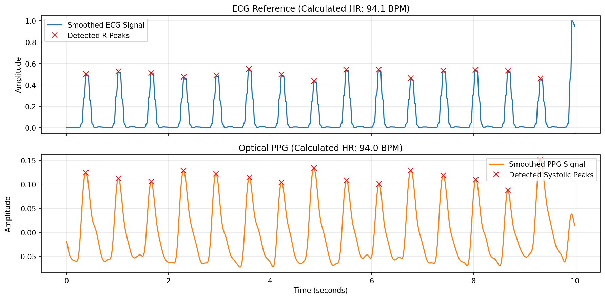

# Robust Heart Rate Extraction (ECG & PPG)

A Python-based Digital Signal Processing (DSP) pipeline designed to accurately estimate heart rate (BPM) from raw, noisy physiological signals. This project streams time-synchronized Electrocardiogram (ECG) and Photoplethysmography (PPG) data and applies robust filtering and peak detection techniques.

## Key Features

* **Direct Data Streaming:** Utilizes `wfdb` to stream ICU patient data directly from the PhysioNet BIDMC dataset without requiring local file management.
* **Pan-Tompkins Style ECG Processing:** Implements a dedicated QRS complex isolation pipeline (bandpass, derivative, squaring, and integration) to maximize the relative amplitude of R-peaks and completely suppress T-waves.
* **Dynamic Peak Detection:** Replaces hardcoded thresholds with dynamic, amplitude-aware prominence calculations that automatically scale to the user's specific signal gain.
* **Physiological Lockouts:** Utilizes a carefully tuned refractory period (0.25s lockout) to handle extreme tachycardia (up to 240 BPM) while preventing classic failure modes like T-wave oversensing.
* **Multi-Modal Support:** Processes both optical PPG and electrical ECG signals in parallel for comparative analysis.

##  Prerequisites & Installation

This project requires Python 3.x. It is highly recommended to run this inside a virtual environment to prevent package conflicts.

1. Clone the repository and navigate to the directory:
```bash
git clone https://github.com/mehdiamian05/PPG-ECG-HR.git
cd PPG-ECG-HR
```

2. Install dependencies:
```bash
pip install wfdb numpy scipy matplotlib jupyter
```

## Dependencies

- wfdb — For streaming physiological records from PhysioNet.
- scipy — For core DSP functions (Butterworth filters, peak detection).
- numpy — For vectorized mathematical operations and array handling.
- matplotlib — For rendering the dual-axis signal visualizations.

## Results
